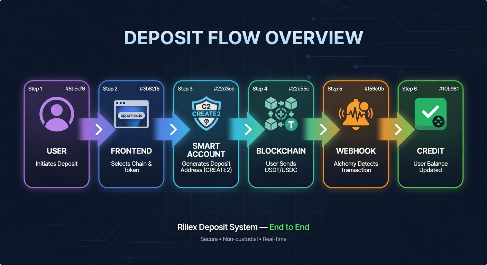
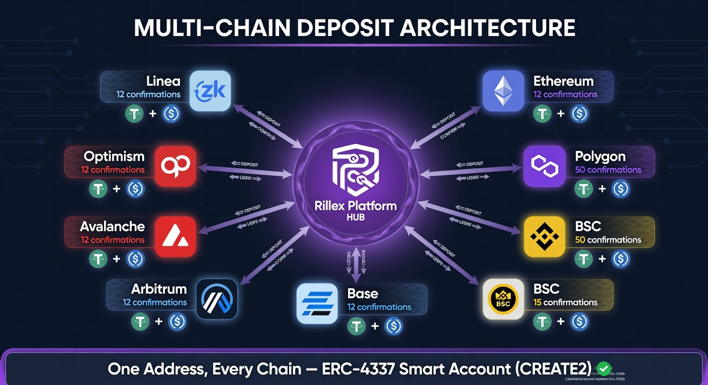
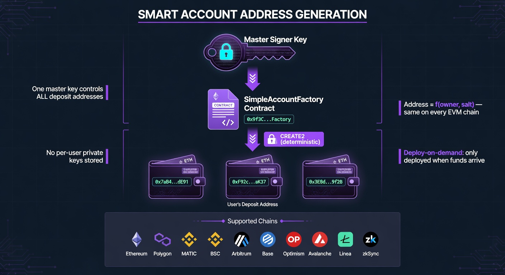
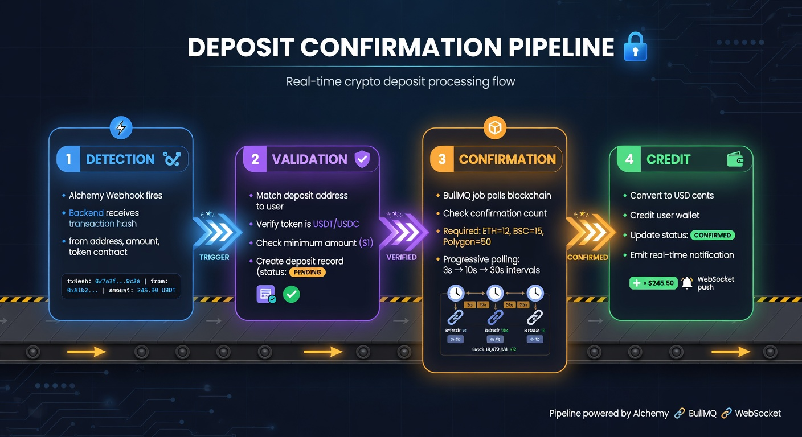
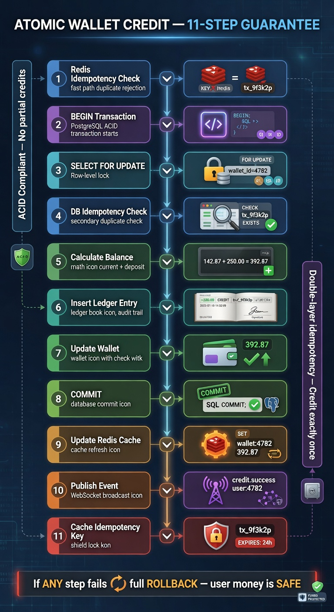
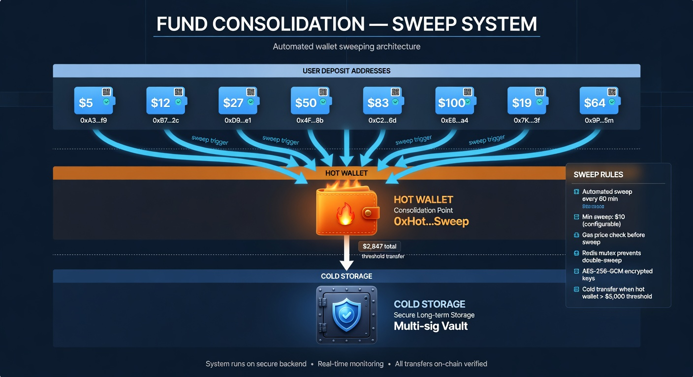
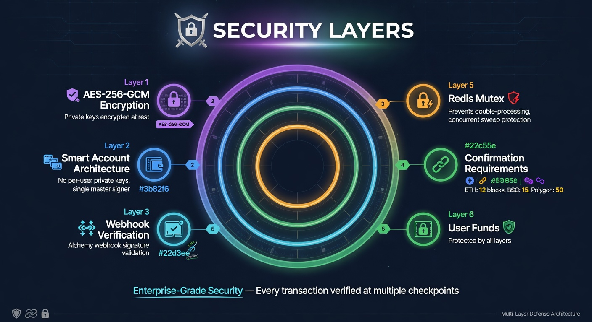
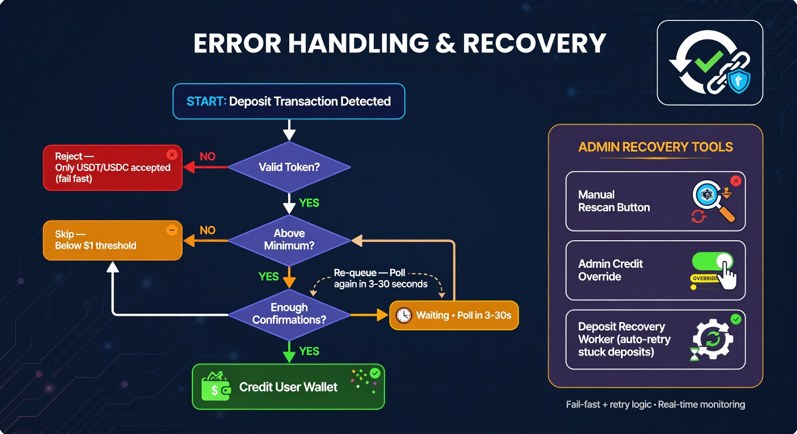
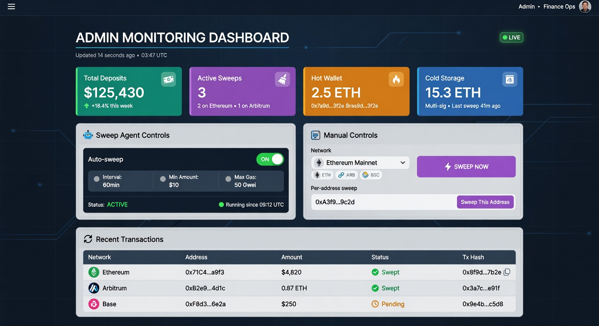
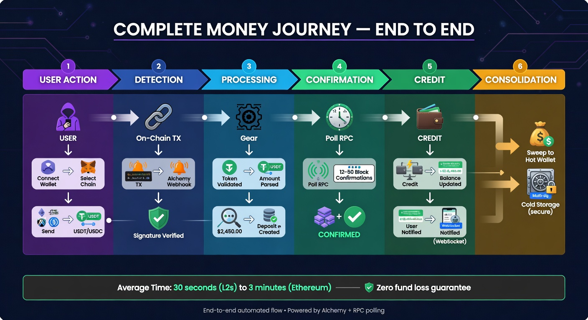

# Rillex — Deposit Money Flow
## Complete Technical & Architectural Documentation

> **Version:** 1.0 | **Date:** June 2026 | **Classification:** Client Confidential
>
> This document describes the complete flow of funds in the Rillex platform from the moment a user initiates a deposit to the point where funds are secured in cold storage. Every layer has been designed with **enterprise-grade security**, **financial integrity**, and **operational reliability** as core principles.

---

## Table of Contents

1. [System Architecture Overview](#1-system-architecture-overview)
2. [Step 1 — User Initiates Deposit (Frontend)](#2-step-1--user-initiates-deposit)
3. [Step 2 — Deposit Address Generation (Backend)](#3-step-2--deposit-address-generation)
4. [Step 3 — On-Chain Transaction Detection (Alchemy Webhooks)](#4-step-3--on-chain-transaction-detection)
5. [Step 4 — Deposit Confirmation Pipeline (BullMQ Workers)](#5-step-4--deposit-confirmation-pipeline)
6. [Step 5 — Wallet Credit (Financial Core)](#6-step-5--wallet-credit)
7. [Step 6 — Fund Consolidation (Sweep System)](#7-step-6--fund-consolidation-sweep)
8. [Step 7 — Cold Storage (Long-Term Security)](#8-step-7--cold-storage)
9. [Security Architecture](#9-security-architecture)
10. [Error Handling & Recovery](#10-error-handling--recovery)
11. [Admin Controls & Monitoring](#11-admin-controls--monitoring)
12. [Multi-Chain Support](#12-multi-chain-support)
13. [Visual Diagrams Reference](#13-visual-diagrams-reference)

---

## 1. System Architecture Overview



The Rillex deposit system is a **7-stage pipeline** that moves funds safely from a user's external wallet to the platform, with full auditability at every step:

```
USER WALLET
    |
    v
[1] Frontend (React/Next.js) — User selects chain, token, amount
    |
    v
[2] Backend API — Generates deterministic Smart Account deposit address
    |
    v
[3] Blockchain — User sends USDT/USDC to their unique deposit address
    |
    v
[4] Alchemy Webhooks — Real-time on-chain event detection
    |
    v
[5] Confirmation Worker — Polls blockchain for N confirmations
    |
    v
[6] Wallet Credit — Atomically credits user's platform balance
    |
    v
[7] Sweep → Hot Wallet → Cold Storage — Fund consolidation & security
```

### Technology Stack

| Component | Technology | Purpose |
|-----------|-----------|---------|
| Frontend | React / Next.js / wagmi / viem | Wallet connection, transaction signing |
| Backend API | Node.js / Elysia / TypeScript | Business logic, webhook handling |
| Database | PostgreSQL (Drizzle ORM) | Financial ledger, deposit records |
| Queue | BullMQ (Redis-backed) | Async job processing (confirmations, sweeps) |
| Cache | Redis (ioredis) | Idempotency, distributed locks, nonce tracking |
| Blockchain | ERC-4337 Smart Accounts | Deposit address generation |
| Monitoring | Alchemy | Webhook-based on-chain event detection |
| Encryption | AES-256-GCM (Web Crypto API) | Private key encryption at rest |

---

## 2. Step 1 — User Initiates Deposit



### User Journey

1. **Connect Wallet** — User connects MetaMask, WalletConnect, or any injected wallet
2. **Select Chain** — Choose from 9 supported EVM chains (Ethereum, Polygon, BSC, Arbitrum, Base, Optimism, Avalanche, Linea, zkSync)
3. **Select Token** — USDT or USDC (stablecoins only)
4. **Enter Amount** — Amount validated against minimum deposit threshold
5. **Confirm Transaction** — User signs the on-chain transaction in their wallet

### Frontend Safety Checks

| Check | What It Does |
|-------|-------------|
| Balance Sufficiency | Ensures user has enough tokens in their wallet |
| Minimum Deposit | Enforces per-chain minimum (prevents dust deposits) |
| Deposit Lock | Prevents double-click double-submission |
| Chain Verification | Ensures wallet is on the correct network |
| Real-time Status | WebSocket subscription for instant confirmation updates |

### Transaction Types

**Direct Deposit (Primary Path):**
- User sends USDT/USDC directly to their deposit address
- Standard ERC-20 `transfer()` call
- Gas paid by user's wallet

**Swap + Deposit (Convenience Path):**
- User holds a different token (e.g., ETH, WBTC)
- 1inch Aggregation Protocol v6 swaps to USDT
- Swap output sent directly to deposit address
- One-click: approve → swap → deposit

---

## 3. Step 2 — Deposit Address Generation



### Architecture: ERC-4337 Smart Accounts

Every user gets a **deterministic deposit address** generated via the **CREATE2** opcode. This is an industry-standard approach used by major exchanges (Coinbase, Binance).

```
Address = CREATE2(factory, owner, salt)

Where:
  factory = SimpleAccountFactory (deployed on every chain)
  owner   = Master Signer Address (single key for all users)
  salt    = User's derivation index (unique integer per user)
```

### Key Properties

| Property | Benefit |
|----------|---------|
| **Deterministic** | Same address across ALL EVM chains — user deposits on any chain, same address |
| **No per-user keys** | Single master signer key controls all accounts — no key management per user |
| **Deploy-on-demand** | Smart Account only deployed when funds arrive — zero gas cost for empty accounts |
| **Counterfactual** | Address is known before deployment — users can send funds immediately |

### Three-Layer Race Condition Protection

Address generation must be atomic to prevent two requests generating the same address:

1. **Redis Distributed Lock** — Prevents concurrent generation for the same user+network (`SET NX` with 10s TTL)
2. **PostgreSQL SEQUENCE** — Atomic index allocation via database sequence — guaranteed unique
3. **UNIQUE Constraint** — Database-level final safety net catches any duplicate that slips through

### Alchemy Registration

After address generation, the address is automatically registered with Alchemy's webhook system across ALL supported chains. This ensures on-chain transactions to this address are detected regardless of which chain the user deposits on.

---

## 4. Step 3 — On-Chain Transaction Detection

### Alchemy Webhook Pipeline

When a user sends tokens to their deposit address, Alchemy's infrastructure detects the on-chain event and sends a webhook to the Rillex backend.

**Endpoint:** `POST /alchemy`

### 6-Layer Webhook Security

| Layer | Protection | Implementation |
|-------|-----------|----------------|
| 1. Signature Presence | Reject unsigned webhooks | Check `x-alchemy-signature` header exists |
| 2. HMAC Verification | Authenticate webhook origin | `HMAC-SHA256(rawBody, networkSigningKey)` with **constant-time comparison** |
| 3. Per-Network Keys | Isolate chain compromise | Each network has its own signing key from environment variables |
| 4. Staleness Check | Prevent old replays | Reject webhooks older than 5 minutes |
| 5. Redis Deduplication | Prevent duplicate processing | `SET NX` with `alchemy-wh:{id}:{timestamp}` key, 10-minute TTL |
| 6. Type Filtering | Ignore irrelevant events | Only process `ADDRESS_ACTIVITY` webhooks |

### Activity Processing (8-Step Pipeline)

```
Webhook Received
    |
    v
[1] Address Ownership — Is this OUR deposit address? (DB lookup)
    |
    v
[2] Currency Resolution — What token was sent? (contract address validation)
    |  CRITICAL: Validates actual contract address, not symbol name
    |  (prevents symbol-spoof attacks)
    |
    v
[3] Amount Parsing — Parse raw amount using token's actual decimals
    |
    v
[4] Minimum Enforcement — Is the deposit above the minimum? (USD-normalized)
    |
    v
[5] Idempotency Check — Have we already processed this txHash?
    |
    v
[6] Confirmation Requirements — How many blocks does this chain need?
    |
    v
[7] Record Creation — Store deposit with full metadata in PostgreSQL
    |
    v
[8] Queue Confirmation Job — BullMQ job with 2-second initial delay
    + Emit DEPOSIT_PENDING event to user via WebSocket
```

### Anti-Spoof Token Validation

A critical security measure: the system **never trusts** the token symbol reported by Alchemy. Instead, it validates the **actual contract address** against the platform's `network_tokens` database table.

This prevents an attack where someone deploys a worthless token with `symbol() = "USDT"` and sends it to a deposit address. The contract address check would fail, and the deposit would be rejected.

---

## 5. Step 4 — Deposit Confirmation Pipeline



### Adaptive Confirmation Polling

The confirmation worker uses an **adaptive retry strategy** that balances speed with efficiency:

| Attempt Range | Delay | Target Chains |
|--------------|-------|---------------|
| 1-10 | 3 seconds | Fast L2s (Base, Arbitrum, Optimism, zkSync) — ~30s total |
| 11-25 | 10 seconds | Medium chains (BSC, Avalanche, Linea) — ~2.5 min |
| 26-200 | 30 seconds | Ethereum mainnet — up to ~87 min for deep reorgs |

### Required Confirmations Per Chain

| Chain | Confirmations | Approximate Time |
|-------|--------------|------------------|
| Ethereum | 12 blocks | ~2.4 minutes |
| Polygon | 50 blocks | ~1.7 minutes |
| BSC | 15 blocks | ~45 seconds |
| Arbitrum | 12 blocks | ~3 seconds |
| Optimism | 12 blocks | ~24 seconds |
| Base | 12 blocks | ~24 seconds |
| Avalanche | 12 blocks | ~24 seconds |
| Linea | 12 blocks | ~24 seconds |
| zkSync | 12 blocks | ~12 seconds |

### Confirmation Flow

```
Check Block Confirmations via RPC
    |
    ├─ NOT ENOUGH → Re-queue with adaptive delay
    |
    └─ THRESHOLD MET →
        |
        ├─ Convert to USD (stablecoins → 1:1)
        |
        ├─ Non-stablecoin? → FAIL FAST (unsupported currency)
        |
        ├─ Approval Policy Check:
        |   ├─ Auto-approved → Credit wallet immediately
        |   └─ Manual required → PENDING_APPROVAL (admin reviews)
        |
        ├─ Credit User Wallet (atomic, idempotent)
        |
        ├─ Emit DEPOSIT_CONFIRMED (real-time WebSocket)
        |
        ├─ Match Promo Codes / Deposit Intents
        |
        ├─ Activate Bonuses (if applicable)
        |
        └─ Trigger Gamification Engine
```

---

## 6. Step 5 — Wallet Credit



### The 11-Step Atomic Credit Pattern

This is the **most critical financial code** in the system. It guarantees that:
- Every deposit is credited **exactly once** (idempotency)
- No balance can go negative (integrity)
- Concurrent credits don't corrupt data (isolation)

```
[1]  Redis Idempotency Check ─── Fast path: if already credited, return instantly
         |
[2]  BEGIN PostgreSQL Transaction
         |
[3]  SELECT FOR UPDATE ─── Row-level lock on user's wallet row
         |
[4]  DB Idempotency Check ─── Correctness guarantee (Redis might have evicted)
         |
[5]  Calculate New Balance ─── current_balance + credit_amount
         |
[6]  Insert Ledger Entry ─── Positive amount, full audit metadata
         |
[7]  Update Wallet Balance ─── Optimistic lock on version column
         |
[8]  COMMIT Transaction
         |
[9]  Update Redis Cache ─── Refresh cached balance for real-time reads
         |
[10] Publish balance_update ─── WebSocket event to frontend
         |
[11] Cache Idempotency Key ─── Prevent future duplicate processing
```

### Idempotency Key Format

```
deposit:{txHash}
```

This means even if the same transaction is processed by both the Alchemy webhook AND the frontend rescan (safety net), the credit happens **exactly once**.

### Double-Protection Against Double-Credit

| Layer | Speed | Guarantee |
|-------|-------|-----------|
| Redis `SET NX` | Fast (< 1ms) | Best-effort — can be evicted |
| PostgreSQL `SELECT ... WHERE idempotency_key = ?` | Slower (~5ms) | Absolute — survives restarts |

---

## 7. Step 6 — Fund Consolidation (Sweep)



### Why Sweep?

Each user has their own deposit address. After deposits, funds are scattered across hundreds of addresses. The **Sweep System** consolidates these funds into a single **Hot Wallet** for:

- Efficient withdrawal processing
- Centralized balance monitoring
- Security (fewer addresses to protect)
- Gas optimization (batch transfers)

### Sweep Architecture

```
┌──────────────────────────────────────────────────┐
│         USER DEPOSIT ADDRESSES                    │
│  ┌─────┐ ┌─────┐ ┌─────┐ ┌─────┐ ┌─────┐       │
│  │ $12 │ │ $50 │ │$100 │ │ $25 │ │$200 │  ...   │
│  └──┬──┘ └──┬──┘ └──┬──┘ └──┬──┘ └──┬──┘       │
│     │       │       │       │       │            │
│     └───────┴───────┼───────┴───────┘            │
│                     │ SWEEP (automated)           │
│                     v                             │
│              ┌─────────────┐                     │
│              │  HOT WALLET  │  ← Consolidation   │
│              │   (0x203..)  │     Point           │
│              └──────┬──────┘                     │
│                     │ COLD TRANSFER              │
│                     │ (when > threshold)          │
│                     v                             │
│              ┌─────────────┐                     │
│              │ COLD STORAGE │  ← Long-term       │
│              │   (0x377..)  │     Security        │
│              └─────────────┘                     │
└──────────────────────────────────────────────────┘
```

### Sweep Safety Features

| Feature | Implementation |
|---------|---------------|
| **Redis Mutex** | Distributed lock prevents concurrent sweep cycles (manual + scheduled) |
| **Gas Price Check** | Skips networks where gas exceeds `maxGasPriceGwei` (configurable) |
| **Minimum Amount** | Skips addresses below `minSweepAmountUsd` (configurable, default $10) |
| **Deploy-on-Demand** | Smart Accounts only deployed when they have balance (saves gas) |
| **Factory Guard** | Rejects sweep if address equals factory contract (corrupted data protection) |
| **Fee Buffer** | 2x gas estimate for Smart Account execute() calls |
| **Admin Configurable** | All thresholds adjustable via admin panel without code deployment |

### Sweep Schedule

- **Automated:** Every 60 minutes (configurable via admin panel)
- **Manual:** Admin can trigger per-network or all-networks via admin panel
- **Per-Address:** Admin can sweep a specific deposit address from the wallet management page

---

## 8. Step 7 — Cold Storage

### Hot → Cold Automatic Transfer

When the hot wallet balance exceeds the configured maximum threshold, excess funds are automatically transferred to the cold wallet (secure offline storage).

| Network | Min Balance | Max Balance | Target After Transfer |
|---------|------------|------------|----------------------|
| Ethereum | 0.5 ETH | 10 ETH | 5 ETH |
| BSC | 1 BNB | 20 BNB | 10 BNB |
| Arbitrum | 0.1 ETH | 5 ETH | 2 ETH |
| Base | 0.1 ETH | 5 ETH | 2 ETH |
| Polygon | 0.5 MATIC | 10 MATIC | 5 MATIC |

### Cold → Hot (Manual Only)

For security, transfers from cold storage to hot wallet **require manual admin intervention**. This prevents automated systems from draining the cold wallet in case of compromise.

---

## 9. Security Architecture



### Defense in Depth — 10 Security Layers

| # | Layer | Threat Mitigated | Implementation |
|---|-------|-----------------|----------------|
| 1 | **AES-256-GCM Encryption** | Key theft from DB | Private keys encrypted at rest with server-side master key |
| 2 | **Smart Account Architecture** | Per-user key management risk | Single master signer, no user keys to leak |
| 3 | **HMAC Webhook Verification** | Webhook spoofing | Per-network signing keys, constant-time comparison |
| 4 | **Replay Protection** | Duplicate webhook processing | 5-min staleness window + Redis deduplication |
| 5 | **Contract Address Validation** | Token symbol spoofing | Verify actual contract, never trust reported symbol |
| 6 | **Confirmation Requirements** | Blockchain reorganization | 12-50 block confirmations per chain |
| 7 | **Atomic Wallet Credits** | Double-crediting | 2-layer idempotency (Redis + PostgreSQL) |
| 8 | **Row-Level Locking** | Concurrent balance corruption | SELECT FOR UPDATE + optimistic versioning |
| 9 | **Redis Mutex** | Concurrent sweep overlap | Distributed lock with TTL-based deadlock prevention |
| 10 | **Manual Cold Storage** | Automated fund drainage | Cold→hot requires human admin intervention |

### Encryption Standards

- **At Rest:** AES-256-GCM (NIST-approved) with 12-byte random IV per encryption
- **Key Derivation:** SHA-256 hash of master key material
- **Password Hashing:** Argon2id (64MB memory, 3 iterations)
- **Signature Verification:** HMAC-SHA256 with constant-time comparison (timing attack resistant)

---

## 10. Error Handling & Recovery



### Automatic Recovery

| Failure Scenario | Auto-Recovery | Mechanism |
|-----------------|---------------|-----------|
| Webhook not received | Yes | Frontend calls `rescanDepositTx()` after on-chain confirmation |
| Confirmation worker crash | Yes | BullMQ automatically retries failed jobs |
| RPC rate limiting | Yes | Exponential backoff with 3 retries per call |
| Redis connection loss | Yes | Webhook dedup falls through to txHash idempotency |
| Database transaction failure | Yes | PostgreSQL ROLLBACK, job retried |

### Manual Recovery Tools (Admin Panel)

| Tool | Purpose |
|------|---------|
| **Manual Rescan** | Re-process a specific transaction hash |
| **Admin Credit** | Override: manually credit a user's wallet |
| **Deposit Recovery Worker** | Automated scan for stuck deposits |
| **Sweep Trigger** | Manually sweep a specific address or network |

### Fail-Fast for Unsupported Currencies

Non-stablecoin deposits (ETH, BTC, etc.) are **immediately rejected** rather than entering an infinite retry loop. The system marks them as `FAILED` with reason `unsupported_currency` and notifies the user via WebSocket.

---

## 11. Admin Controls & Monitoring



### Sweep Agent Configuration

| Setting | Default | Description |
|---------|---------|-------------|
| `autoEnabled` | true | Enable/disable automated sweep cycles |
| `paused` | false | Temporarily pause without disabling |
| `minSweepAmountUsd` | $10 | Skip addresses below this threshold |
| `intervalMinutes` | 60 | Sweep cycle frequency |
| `maxGasPriceGwei` | 50 | Skip if gas price exceeds this |
| `gasWarningThresholdEth` | 0.05 | Warn if hot wallet gas below this |
| `gasAlertEnabled` | true | Enable gas warning alerts |

### Real-Time Dashboard

- **KPI Cards:** Total deposits, active sweeps, hot wallet balance, cold storage balance
- **Per-Network Stats:** Sweep count, gas status, balance per chain
- **Transaction History:** Real-time table of all sweep and cold transfer transactions
- **Gas Warnings:** Automatic alerts when hot wallet gas is running low
- **Audit Logs:** Every admin action logged with actor, timestamp, and details

### Permission System

| Permission | Who | Actions |
|-----------|-----|---------|
| `wallet:read` | All admins | View balances, transaction history |
| `wallet:manage` | Senior admins | Trigger sweeps, configure settings |
| `sweep:manage` | Sweep operators | Access sweep agent page |

---

## 12. Multi-Chain Support

### Supported Chains

| Chain | Chain ID | Native Token | Confirmations | USDT | USDC |
|-------|----------|-------------|---------------|------|------|
| Ethereum | 1 | ETH | 12 | Yes | Yes |
| Polygon | 137 | MATIC | 50 | Yes | Yes |
| BSC | 56 | BNB | 15 | Yes | Yes |
| Arbitrum | 42161 | ETH | 12 | Yes | Yes |
| Optimism | 10 | ETH | 12 | Yes | Yes |
| Base | 8453 | ETH | 12 | — | Yes |
| Avalanche | 43114 | AVAX | 12 | Yes | Yes |
| Linea | 59144 | ETH | 12 | Yes | Yes |
| zkSync | 324 | ETH | 12 | Yes | Yes |

### One Address, Every Chain

Thanks to the ERC-4337 Smart Account architecture with CREATE2, every user gets the **exact same deposit address on every chain**. This dramatically simplifies the user experience — one address to remember, works everywhere.

---

## 13. Visual Diagrams Reference

All diagrams are stored in the `money-flow/` directory:

| # | File | Description |
|---|------|-------------|
| 1 | `01-deposit-flow-overview.jpg` | End-to-end deposit flow (6 stages) |
| 2 | `02-smart-account-generation.jpg` | Smart Account address derivation architecture |
| 3 | `03-confirmation-pipeline.jpg` | 4-stage confirmation pipeline (detect → validate → confirm → credit) |
| 4 | `04-sweep-consolidation.jpg` | Fund consolidation: deposit addresses → hot wallet → cold storage |
| 5 | `05-security-layers.jpg` | 6-layer security onion diagram |
| 6 | `06-multi-chain-architecture.jpg` | Hub-and-spoke multi-chain support |
| 7 | `07-error-handling-recovery.jpg` | Error handling flowchart with recovery paths |
| 8 | `08-admin-monitoring.jpg` | Admin dashboard mockup with KPIs and controls |
| 9 | `09-atomic-wallet-credit.jpg` | 11-step atomic wallet credit guarantee flow |
| 10 | `10-complete-money-journey.jpg` | Complete end-to-end money journey timeline |

---

## Summary



The Rillex deposit system represents a **production-grade, enterprise-level cryptocurrency payment infrastructure** with:

- **9 supported EVM chains** with automatic cross-chain address generation
- **6-layer webhook security** preventing spoofing, replay, and symbol-spoof attacks
- **11-step atomic wallet credit** with double-layered idempotency
- **Automated fund consolidation** with configurable safety thresholds
- **Comprehensive admin tooling** for monitoring, manual intervention, and configuration
- **Fail-safe error handling** with automatic recovery at every stage

Every component has been designed with the assumption that **any individual system can fail** — and the overall pipeline remains safe, correct, and recoverable.

---

*Document generated from live codebase analysis. All function names, security checks, and data flows verified against source code.*